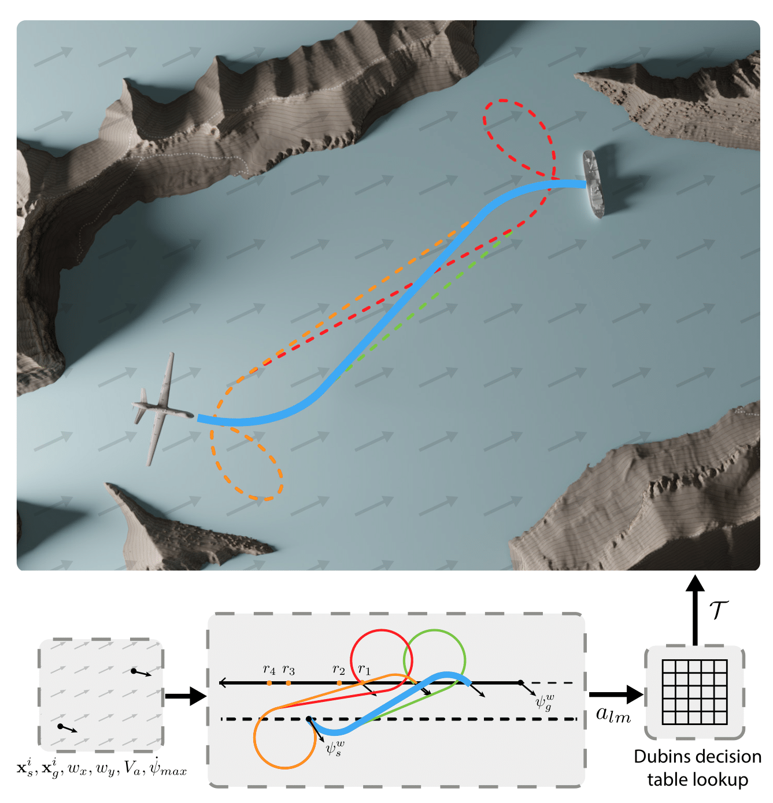

# Time-Optimal Path Planning in a Constant Wind for Uncrewed Aerial Vehicles using Dubins Set Classification 

This repository contains code for the paper
**<a href="https://arxiv.org/abs/2306.11845">"Time-Optimal Path Planning in a Constant Wind for Uncrewed Aerial Vehicles using Dubins Set Classification"</a>**  by *<a href="https://bradymoon.com">Brady Moon\*</a>, <a href="https://sagars2.com">Sagar Sachdev\*</a>, <a href="https://theairlab.org/team/junbiny/">Junbin Yuan</a>, and <a href="https://www.ri.cmu.edu/ri-faculty/sebastian-scherer/">Sebastian Scherer</a> (\* equal contribution)*.

This codebase includes both a solver for trochoidal paths when there is wind as well as also solving Dubins paths when there is no wind. The Dubins path solutions use the work <a href="http://dx.doi.org/10.1016/S0921-8890(00)00127-5">"Classification of the Dubins set"</a> as well as the correction proposed in the work  <a href="https://www.research-collection.ethz.ch/handle/20.500.11850/615185">"Circling Back: Dubins set Classification Revisited."</a>

<p align="center">   
    
</p>

## Brief Overview
Time-optimal path planning in high winds for a turning-rate constrained UAV is a challenging problem to solve and is important for deployment and field operations. Previous works have used trochoidal path segments comprising straight and maximum-rate turn segments, as optimal extremal paths in uniform wind conditions. Current methods iterate over all candidate trochoidal trajectory types and select the one that is time-optimal; however, this exhaustive search can be computationally slow. In this paper, we introduce a method to decrease the computation time. This is achieved by reducing the number of candidate trochoidal trajectory types by framing the problem in the air-relative frame and bounding the solution within a subset of candidate trajectories. Our method reduces overall computation by 37.4% compared to pre-existing methods in Bang-Straight-Bang trajectories, freeing up computation for other onboard processes and can lead to significant total computational reductions when solving many trochoidal paths. When used within the framework of a global path planner, faster state expansions help find solutions faster or compute higher-quality paths. We also release our open-source codebase as a C++ package.


## Prerequisites
* Ubuntu 18.04 or 20.04
* ROS Melodic or Noetic 
* Python 3.6+ (For visualizations)
* Google Benchmark (For benchmarks)
    * `sudo apt-get install libbenchmark-dev`
* Eigen3
    * `sudo apt-get install libeigen3-dev`

### Building and Installation

Clone this repo in your catkin workspace or create a new workspace like in the following:

```bash
mkdir -p ~/trochoids_ws/src
cd  ~/trochoids_ws/src
git clone git@github.com:castacks/trochoids.git
cd ../
catkin build
```

#### Docker Option
If you would like to run the code in a docker container, you can use the provided Dockerfile. No need to setup the workspace as above. Just run the following in the repo:

```bash
docker compose build
docker compose run --rm trochoids_ws
catkin build
```


### Building and Running Unit Tests and Benchmarks

To build the unit tests and run them (optional), run the following command:

```bash
catkin build --make-args tests
```

Source the workspace.

```bash
source devel/setup.bash # devel/setup.zsh if using zsh
```
The randomized failure-discovery sweeps are built as a separate
`trochoids-random-test` executable and carry the CTest label `long_random`.
Run the fast unit tests from the package build directory with:

```bash
# From <workspace>/build/trochoids
ctest --output-on-failure -LE long_random -j4
```

Run the long randomized suite periodically with:

```bash
# From <workspace>/build/trochoids
ctest --output-on-failure -L long_random
```

To run every test, including the long randomized suite:

```bash
# From <workspace>/build/trochoids
ctest --output-on-failure -j4
```

Individual test executables and GoogleTest filters can also be run from the
workspace root. For example:

```bash
./devel/lib/trochoids/trochoids-chebyshev-test \
  --gtest_filter="TestChebyshev.root_solver_1d_all_methods_match_fixed_cases"

./devel/lib/trochoids/trochoids-random-test \
  --gtest_filter="RandomizedDiscovery.compare_bbb_methods_without_wind"
```

The fast tests are split across the core, classification, Chebyshev, and 3D
test executables. The randomized executable samples many generated states to
search for new failure cases and also tests the slower 2D methods, so it is intentionally excluded from the normal
fast-test command above.

### Running Benchmarks
```bash
./devel/lib/trochoids/trochoids-benchmark 
```

### Visualizing 3D unit test paths

The dedicated 3D test target writes CSV path outputs (`x,y,z,psi`) that you can visualize:

```bash
# choose CSV output directory
# native/host:
# export TROCHOIDS_3D_CSV_DIR=csv_files/3d
#
# docker:
# export TROCHOIDS_3D_CSV_DIR=/ws/src/trochoids/csv_files/3d
export TROCHOIDS_3D_CSV_DIR=/ws/src/trochoids/csv_files/3d

# run only the 3D tests
./devel/lib/trochoids/trochoids-3d-test

# render XY and 3D figures from all generated CSV files
python3 /ws/src/trochoids/test/visualize_trochoids_3d.py --csv-dir /ws/src/trochoids/csv_files/3d
```

Figures are saved to `figures/3d` by default.
If you use `docker compose run --rm`, only mounted paths persist after the container exits.

## Usage

The main function for the trochoid solver is `get_trochoid_path()`. This function takes in the following parameters:

* Start State: [x, y, z, psi]
* Goal State: [x, y, z, psi]
* Wind: [x, y, z]
* Desired Speed (m/s)
* Max Kappa: 1/turning_radius (1/m)
* (Optional) Waypoint Distance: The distance between waypoints in the trochoid path (m)


If there is no wind, it solves for the path using a Dubins path, and if there is wind it uses a trochoidal path. 

### Simple Example
```cpp
double wind[3] = {0.3, 0.5, 0};
double desired_speed = 15;
double max_kappa = .02;
double waypoint_distance = 10;

trochoids::XYZPsiState start_state = {0, 0, 110, 0};
trochoids::XYZPsiState goal_state = {500, 0, 110, 0};

std::vector<trochoids::XYZPsiState> trochoid_path;
bool valid = trochoids::get_trochoid_path(start_state, goal_state, trochoid_path, wind, desired_speed, max_kappa, waypoint_distance);
```


## Citation
If you find this work useful, please cite our paper:
```BibTeX
@article{moon2023timeoptimal,
    title={Time-Optimal Path Planning in a Constant Wind for Uncrewed Aerial Vehicles using Dubins Set Classification}, 
    author={Brady Moon and Sagar Sachdev and Junbin Yuan and Sebastian Scherer},
    year={2023},
    journal = {IEEE Robotics and Automation Letters},
    publisher = {IEEE},
    doi = {10.1109/LRA.2023.3333167},
    url = {https://arxiv.org/pdf/2306.11845.pdf},
    video = {https://youtu.be/qOU5gI7JshI}
}
```
